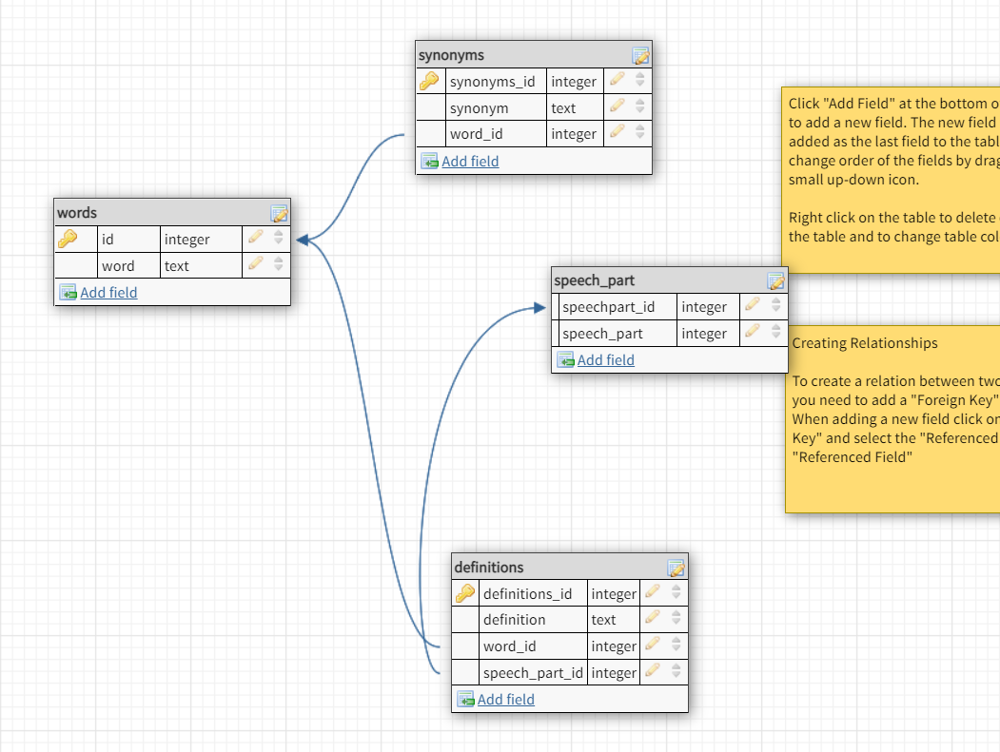

# vwordle
Yet another Wordle implementation by vamastah. The original idea comes from Josh Wardle, a Welsh-born software engineer.
## how to play
Players have six attempts to guess a five-letter word; feedback is given for each guess, in the form of colored tiles, indicating when letters match or occupy the correct position. The mechanics are nearly identical to the 1955 pen-and-paper game Jotto and the US television gameshow Lingo.

Tile types:
- green - a letter is in the word and in the correct spot,
- yellow - a letter is in the word but in the wrong spot,
- gray - a letter is not in the word in any spot.

## hardware requirements
The game was created with retro handhelds in mind, so it should run properly on any device supporting 320x240 resolution.

At the moment the game has been ported to the following platforms:
- MiyooCFW (Bittboy, PocketGo, Powkiddy V90, etc.),
- RetroFW (RS97, LDK, RG300, etc.),
- LG webOS TV 4.0 and above.

## known issues
- [MiyooCFW] background music plays once and then stops playing.
- [LG webOS TV 4.0/5.0] visual flickering and instability. The game works fine on webOS TV 6.0 and 22.

## license
The source code of the game is licensed under GNU GPL 3.0 by vamastah.

The music is licensed under CC BY 4.0 by M33 Project.
https://freemusicarchive.org/

The click1 sound is licensed under CC0 1.0 by Ranner.
https://freesound.org/

The click2 sound is licensed under CC0 1.0 by errysn.
https://freesound.org/

The word definitions are from wordset-dictionary founded by Hampton Lintorn Catlin and Michael Lintorn Catlin.
https://github.com/wordset/wordset-dictionary

## word definitions

definition controls:

left arrow/L1 - switch to previous definition

right arrow/R1 - switch to next definition

database: sqlite3

database scheme:

script for build database: [click here](./definitions/createdefinitions.pyzc)

	
